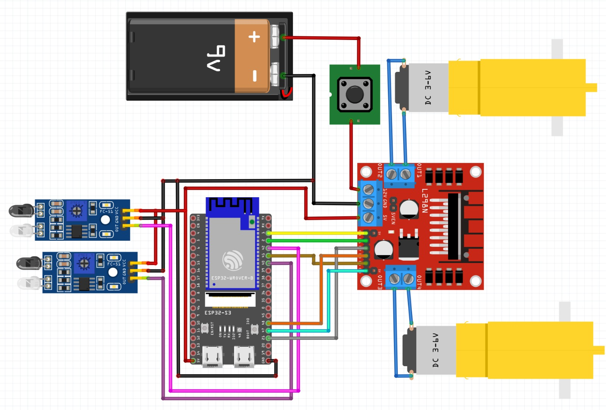
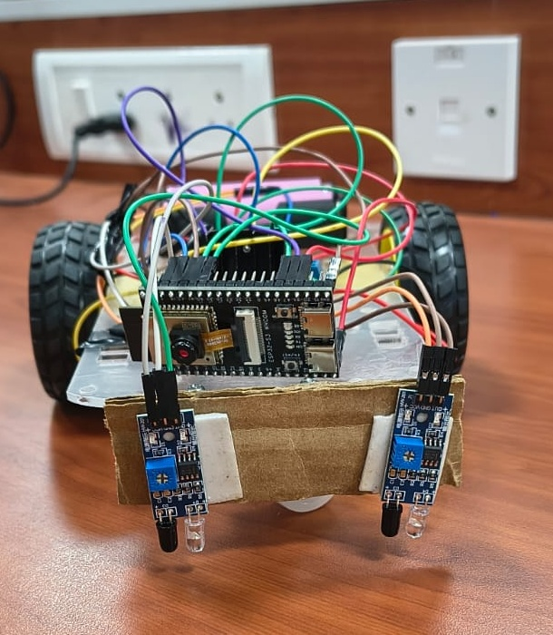
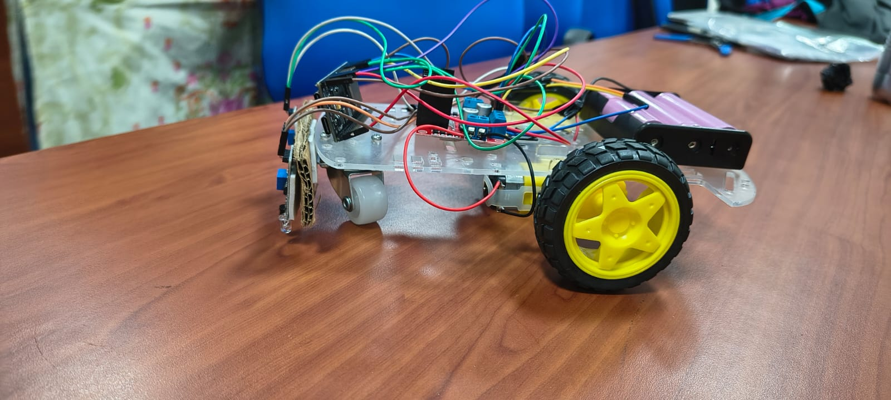
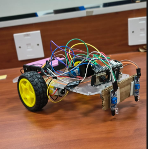
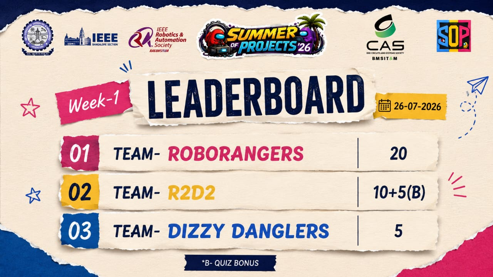

# IR Line Following Robot 
A small autonomous line-following robot built as part of IEEE RAS Summer of Projects 2026 at BMSIT.

## Overview
This robot uses two IR line sensors to detect a dark line on a light-coloured surface and an ESP32-S3-CAM to control the movement of the robot.
The robot operates autonomously without remote control once powered on.

## Hardware
- ESP32-S3-CAM
- L298N Motor Driver
- 2 × IR Line Sensor Modules (LM393-based)
- 2 × DC Gear Motors
- Caster Wheel
- 7–12V Battery Pack
- Robot Chassis
- Jumper Wires
  
## How It Works
Two IR sensors are positioned at the front of the robot with a small gap between them.
The ESP32 reads the sensors and determines whether the robot needs to move straight, turn left, turn right, or stop.

### Basic Logic
| Left Sensor | Right Sensor | Robot Action |
|-------------|--------------|--------------|
| OFF | OFF | Move straight |
| ON | OFF | Turn left |
| OFF | ON | Turn right |
| ON | ON | Stop |

## Components & Connections
<table>
  <tr>
    <td></td>
  </tr>
</table>

<table>
  <tr>
    <td>
 ESP32-S3-CAM → L298N

| ESP32 Pin | L298N Pin | Function |
|-----------|-----------|----------|
| GPIO1 | ENA | Left motor PWM |
| GPIO2 | IN1 | Left motor direction |
| GPIO21 | IN2 | Left motor direction |
| GPIO47 | ENB | Right motor PWM |
| GPIO48 | IN3 | Right motor direction |
| GPIO41 | IN4 | Right motor direction |

  </td>
    <td>
 ESP32-S3-CAM → IR Sensors

| ESP32 Pin | Connection |
|-----------|------------|
| GPIO42 | Left IR sensor OUT |
| GPIO40 | Right IR sensor OUT |
| 5V | Both sensor VCC |
| GND | Both sensor GND |

  </td>

  </tr>
</table>

## Software
- Arduino IDE
- ESP32 board support
- C/C++

## Project Photos and videos
<table>
  <tr>
    <td></td>
    <td></td>
    <td></td>
  </tr>
</table>

## Demo
[▶️ Watch Demo Video](media/demo.mp4)

## What I Learned
- Basic robotics and embedded systems
- IR sensor-based line detection
- Motor control using an L298N motor driver
- PWM-based motor speed control
- ESP32 GPIO control
- Hardware debugging and sensor calibration

## Results
🏆 **IEEE RAS Summer of Projects 2026 – Week 1 Winner**
Our robot successfully completed the line-following track in **13.99 seconds**, securing the **fastest time of the week**.

<table>
  <tr>
    <td></td>
    <td></td>
  </tr>
</table>

## Future Improvements
- Improve performance on sharp turns as well as shiny floors
- Experiment with motor speed tuning
- Explore multi-sensor line detection
  
